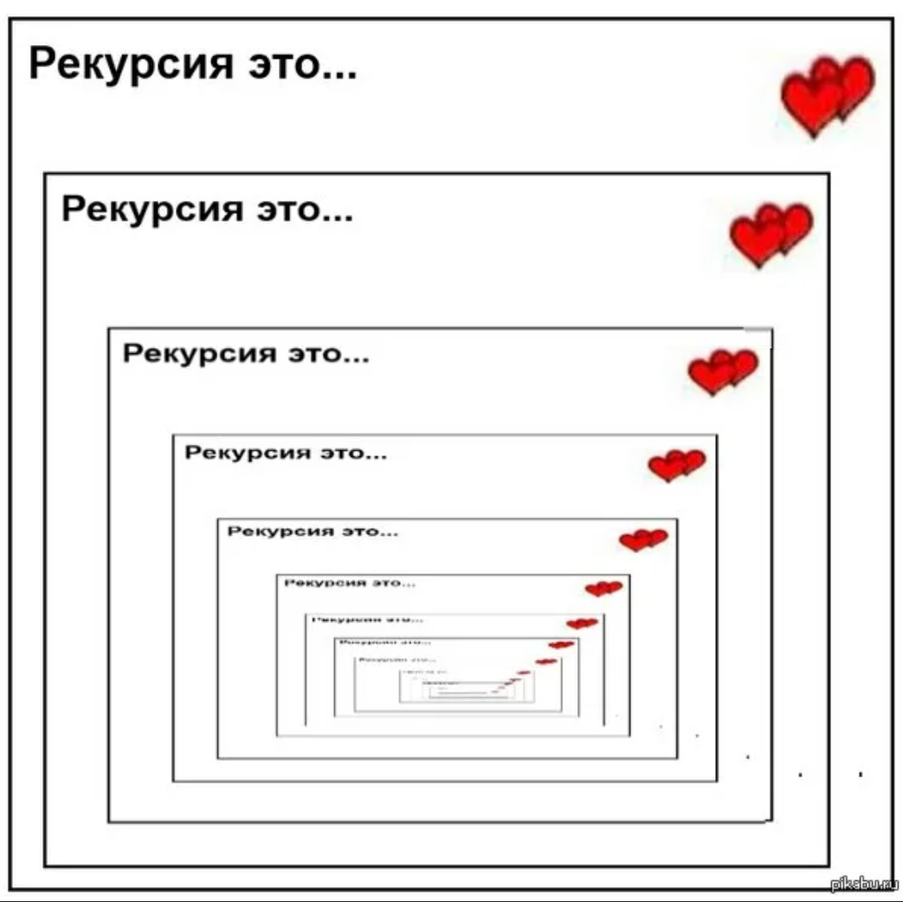
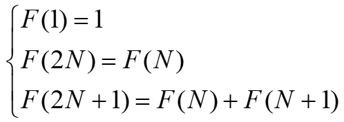

# ***Рекурсия***
<div align="center">
  
</div>

Рекурсия - это такой способ организации вспомогательного алгоритма (подпрограммы), при котором эта подпрограмма (процедура или функция) в ходе выполнения ее операторов обращается сама к себе. То есть в теле функции она вызывает саму себя.

# ***Оглавление***
1. [Факториал](#факториал)
2. [НОД](#нод)
3. [Числа Фибоначчи](#числа-фибоначчи)
4. [Метод половинного деления](#метод-половинного-деления)
5. [Сумма цифр числа](#сумма-цифр-числа)
6. [Функция](#функция)
7. [Ханойская башня](#ханойская-башня)
8. [Заключение](#заключение)

## **Факториал**
Факториал — это математическая функция, применяемая к целым неотрицательным числам.

**Простое определение:**

Факториал числа n — это произведение всех натуральных чисел от 1 до этого числа.

Обозначается он восклицательным знаком: n!

Формула:
n! = 1 × 2 × 3 × ... × n

**Примеры:**

3! = 1 × 2 × 3 = 6

5! = 1 × 2 × 3 × 4 × 5 = 120

7! = 1 × 2 × 3 × 4 × 5 × 6 × 7 = 5040

```go
func Factorial(n int) int {
	if n == 1 {
		return 1
	} else if n > 1 {
		return Factorial(n-1) * n
	}
	return 1
}
```

[Вернуться к оглавлению](#оглавление)

## **НОД**
НОД — это аббревиатура, которая расшифровывается как Наибольший Общий Делитель.

Простыми словами, НОД двух или более чисел — это самое большое число, на которое все эти числа делятся без остатка.

**Пример:**

Возьмем числа 12 и 18.

Делители числа 12: 1, 2, 3, 4, 6, 12.

Делители числа 18: 1, 2, 3, 6, 9, 18.

Какие делители являются общими для обоих чисел? Это 1, 2, 3, 6.

Наибольший из них — 6.

Значит, НОД(12, 18) = 6.

```go
func НОД(a, b int) int {
	if a > b {
		return НОД(a-b, b)
	} else if a < b {
		return НОД(a, b-a)
	}
	return a
}
```

[Вернуться к оглавлению](#оглавление)

## **Числа Фибоначчи**
Числа Фибоначчи — это элементы знаменитой числовой последовательности, в которой каждое последующее число равно сумме двух предыдущих.

Первые 10 чисел последовательности: 1, 1, 2, 3, 5, 8, 13, 21, 34, 55

**Математика:**

* Золотое сечение (φ): Если делить соседние числа Фибоначчи (большее на меньшее), то с ростом номера это отношение стремится к золотому сечению φ ≈ 1.618....

**Природа:**

* Количество лепестков у многих цветов (ирис - 3, лютик - 5, дельфиниум - 8, астра - 21, 34, 55).

* Укладка семян в подсолнухе, шишек в сосновой шишке, ячеек ананаса (располагаются по спиралям, количество которых является числами Фибоначчи).

* Ветвление деревьев, расположение листьев на стебле.

```go
func Fibonacci(n int) int {
	if n == 0 {
		return 0
	} else if n == 1 {
		return 1
	} else if n > 1 {
		return Fibonacci(n-1) + Fibonacci(n-2)
	}
	return -1
}
```
[Вернуться к оглавлению](#оглавление)

## **Метод половинного деления**
Метод половинного деления (или метод бисекции) — это простой и надежный численный метод для нахождения приближенного корня уравнения с заданной точностью.

Проще говоря, если у нас есть уравнение вида f(x) = 0 и мы знаем, что на некотором отрезке [a, b] корень существует, то метод половинного деления позволяет последовательно сужать этот отрезок, пока его длина не станет меньше требуемой погрешности.

**Основная идея:**

1. Мы находим отрезок [a, b], на концах которого функция принимает значения разных знаков (т.е. f(a) * f(b) < 0). Из теоремы Больцано-Коши следует, что если функция непрерывна на этом отрезке, то на нем существует хотя бы один корень.

2. Мы делим этот отрезок пополам, находя середину c = (a + b) / 2.

3. Смотрим, в какой половине находится корень:

   * Если f(a) и f(c) имеют разные знаки, значит, корень лежит между a и c. Тогда мы принимаем c за новую правую границу (b = c).

   * Если f(c) и f(b) имеют разные знаки, значит, корень лежит между c и b. Тогда мы принимаем c за новую левую границу (a = c).

4. Процесс повторяется до тех пор, пока длина отрезка [a, b] не станет меньше заранее заданной точности ε.

$f(x) = \arccos(x) - \sqrt{1 - 0,3x^3}$ — её и будем иследовать.

```go
func f(x float64) float64 {
	return math.Acos(x) - math.Sqrt(1-0.3*math.Pow(x, 3))
}

func Bisection(a, b, epsilon float64) float64 {
	if math.Abs(b-a) < epsilon {
		return (a + b) / 2
	}

	c := (a + b) / 2
	fc := f(c)

	if fc == 0 {
		return c
	}

	if f(a)*fc < 0 {
		return Bisection(a, c, epsilon)
	} else {
		return Bisection(c, b, epsilon)
	}
}
```
[Вернуться к оглавлению](#оглавление)

## **Сумма цифр числа**
Сумма цифр числа — это результат сложения всех отдельных цифр, из которых состоит это число.

Проще говоря, вы берете число, разбираете его на отдельные цифры и эти цифры складываете.

**Пример:**

Число: 123

Цифры: 1, 2 и 3

Сумма цифр: 1 + 2 + 3 = 6

**Для чего нужно: (Применение)**

> Признаки делимости. Например, знаменитый признак делимости на 3.  Число делится на 3 тогда и только тогда, когда сумма его цифр делится на 3. Тоже самое и с 9.

> Криптография и контрольные суммы. В сложных алгоритмах шифрования и проверки целостности данных (например, в номерах банковских карт) используются модифицированные операции с суммой цифр.

```go
func Sum(n int) int {
	if n < 10 {
		return n
	}
	return n%10 + Sum(n/10)
}
```

[Вернуться к оглавлению](#оглавление)

## **Функция**
<div align="center">
  
</div>

Это рекурсивная функция, известная как последовательность Штерна-Броко (Stern–Brocot sequence) или диатомическая последовательность.

1. Симметрия
Функция симметрична: F(n) = F(n+1) для многих значений, создавая "горный ландшафт"

2. Все взаимно простые пары
Эта последовательность генерирует все несократимые дроби: F(n)/F(n+1) даёт все рациональные числа между 0 и 1

3. Связь с последовательностью Фибоначчи
Максимальные значения в последовательности растут подобно числам Фибоначчи

```go
func f(n int) int {
	if n == 1 {
		return 1
	} else if n%2 == 0 {
		return f(n/2)
	} else {
		return f(n/2) + f(n/2+1)
	}
}
```

[Вернуться к оглавлению](#оглавление)

## **Ханойская башня**
Ханойская башня — это головоломка, где нужно перенести башню из дисков разного размера с одного стержня на другой, соблюдая правила:

1. Перемещать по одному диску за раз

2. Брать только верхний диск

3. Не класть большой диск на маленький

**Особенности:**

* Классический пример рекурсии в программировании

* Минимальное число ходов: 2ⁿ - 1 для n дисков

* Согласно легенде, монахи перемещают 64 диска — когда закончат, наступит конец света (это займет ~585 млрд лет)

**Суть:** чтобы переместить n дисков, нужно сначала переместить (n - 1) дисков на вспомогательный стержень, потом самый большой диск, и затем (n - 1) дисков на конечный стержень.

```go
func Hanoi(n int, A, C, B string) {
	if n == 1 {
		fmt.Printf("Переместить диск 1 с %s на %s\n", A, C)
		return
	}

	Hanoi(n-1, A, B, C)
	fmt.Printf("Переместить диск %d с %s на %s\n", n, A, C)
	Hanoi(n-1, B, C, A)
}
```

[Вернуться к оглавлению](#оглавление)

## **Заключение**

[Вернуться к оглавлению](#оглавление)

[Вернуться на главную страницу](/README.md)


<div align="center">
  
</div>

---
<div align="center"> Made with ❤️ by <b>l1m3ow</b> </div>