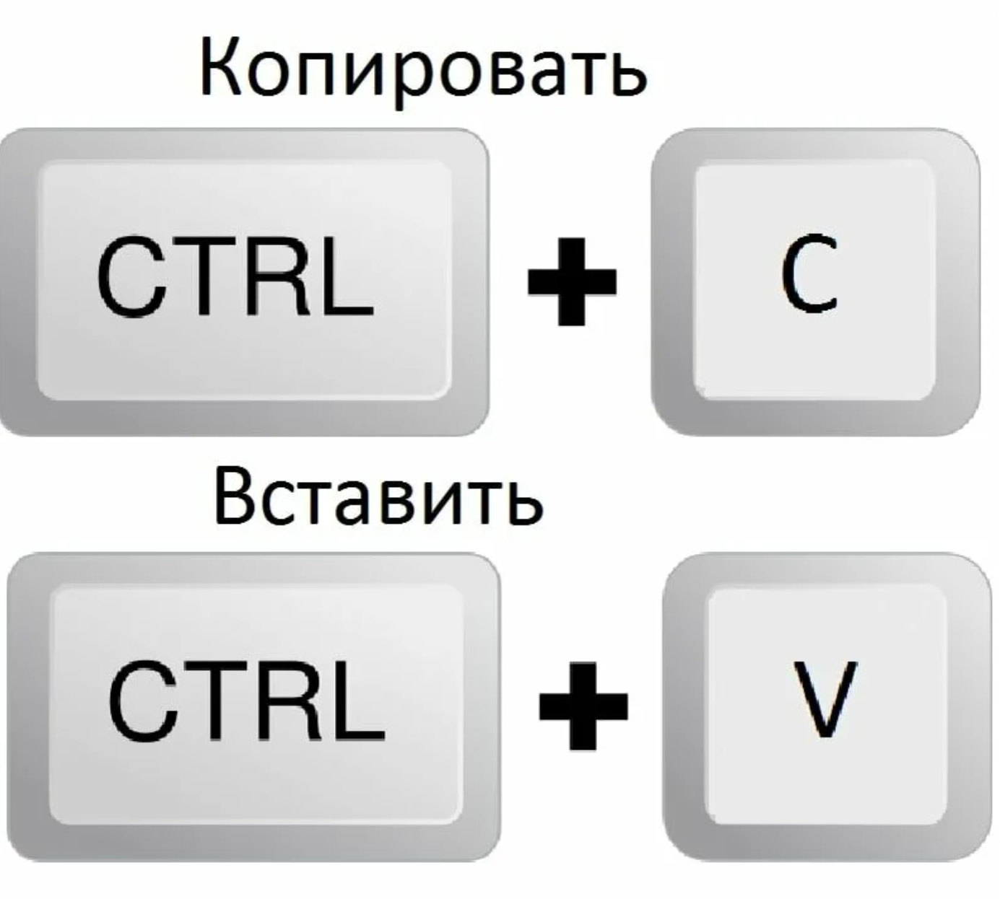

# ***Тема №3: Алгоритмы сортировок***
<div align="center">
  
</div>

Алгоритмы сортировки — это фундаментальные процедуры в компьютерных науках, предназначенные для упорядочивания элементов данных в определённом порядке, что критически важно для эффективного выполнения последующих операций, таких как быстрый поиск, анализ данных и оптимизация работы приложений. Их важность невозможно переоценить, поскольку они лежат в основе бесчисленного множества систем — от баз данных и файловых менеджеров до сложных алгоритмов машинного обучения, напрямую влияя на производительность, отзывчивость и общую эффективность вычислительных процессов в современном цифровом мире.

# ***Оглавление***

1. [Пузырьковая сортировка](#пузырьковая-сортировка)
2. [Шейкерная сортировка](#шейкерная-сортировка)
3. [Сортировка вставками](#сортировка-вставками)
4. [Сортировка выбором](#сортировка-выбором)
5. [Сортировка алгоритмом шелла](#сортировка-алгоритмом-шелла)
6. [Гномья сортировка](#гномья-сортировка)
7. [Заключение](#заключение)

## ***Пузырьковая сортировка***
<div align="center">
  
</div>

**Пузырьковая сортировка** — один из простейших алгоритмов сортировки. Суть алгоритма в том, что совершается несколько проходов по массиву. При каждом проходе попарно **сравниваются два соседних элемента.** Если они находятся в верном порядке, то ничего не происходит, в противном случае они меняются местами. В результате первого прохода **максимальный элемент окажется в конце, то есть всплывет словно пузырек.** Затем все повторяется до того момента пока весь массив не будет отсортирован.

```go
func Bubble(arr []int) {
	fmt.Println("\n---Пузырьковая сортировка---")

	size := len(arr)

	for j := 0; j < size-1; j++ {
		swap := false
		fmt.Printf("\nПроход по массиву номер %d\n", j+1)
		fmt.Printf("Массив : %d \n", arr)

		for k := 0; k < size-1-j; k++ {
			if arr[k] > arr[k+1] {
				fmt.Printf("Обмен: [%d]%d ↔ [%d]%d\t", k, arr[k], k+1, arr[k+1])
				arr[k], arr[k+1] = arr[k+1], arr[k]
				swap = true
				fmt.Printf("Массив теперь : %d\n", arr)
			}
		}

		if !swap {
			break
		}
	}
}
```

*Что происходит*
<div align="center">
  
</div>

*Пример работы кода*

```
Введите размер массива: 10

---Пузырьковая сортировка---

Проход по массиву номер 1
Массив : [75 83 56 11 44 82 49 35 26 17] 
Обмен: [1]83 ↔ [2]56    Массив теперь : [75 56 83 11 44 82 49 35 26 17] 
Обмен: [2]83 ↔ [3]11    Массив теперь : [75 56 11 83 44 82 49 35 26 17] 
Обмен: [3]83 ↔ [4]44    Массив теперь : [75 56 11 44 83 82 49 35 26 17] 
Обмен: [4]83 ↔ [5]82    Массив теперь : [75 56 11 44 82 83 49 35 26 17] 
Обмен: [5]83 ↔ [6]49    Массив теперь : [75 56 11 44 82 49 83 35 26 17] 
Обмен: [6]83 ↔ [7]35    Массив теперь : [75 56 11 44 82 49 35 83 26 17] 
Обмен: [7]83 ↔ [8]26    Массив теперь : [75 56 11 44 82 49 35 26 83 17] 
Обмен: [8]83 ↔ [9]17    Массив теперь : [75 56 11 44 82 49 35 26 17 83] 

Проход по массиву номер 2
Массив : [75 56 11 44 82 49 35 26 17 83] 
Обмен: [0]75 ↔ [1]56    Массив теперь : [56 75 11 44 82 49 35 26 17 83] 
Обмен: [1]75 ↔ [2]11    Массив теперь : [56 11 75 44 82 49 35 26 17 83] 
Обмен: [2]75 ↔ [3]44    Массив теперь : [56 11 44 75 82 49 35 26 17 83] 
Обмен: [4]82 ↔ [5]49    Массив теперь : [56 11 44 75 49 82 35 26 17 83] 
Обмен: [5]82 ↔ [6]35    Массив теперь : [56 11 44 75 49 35 82 26 17 83]
Обмен: [6]82 ↔ [7]26    Массив теперь : [56 11 44 75 49 35 26 82 17 83]
Обмен: [7]82 ↔ [8]17    Массив теперь : [56 11 44 75 49 35 26 17 82 83]

Проход по массиву номер 3
Массив : [56 11 44 75 49 35 26 17 82 83]
Обмен: [0]56 ↔ [1]11    Массив теперь : [11 56 44 75 49 35 26 17 82 83]
Обмен: [1]56 ↔ [2]44    Массив теперь : [11 44 56 75 49 35 26 17 82 83]
Обмен: [3]75 ↔ [4]49    Массив теперь : [11 44 56 49 75 35 26 17 82 83]
Обмен: [4]75 ↔ [5]35    Массив теперь : [11 44 56 49 35 75 26 17 82 83]
Обмен: [5]75 ↔ [6]26    Массив теперь : [11 44 56 49 35 26 75 17 82 83]
Обмен: [6]75 ↔ [7]17    Массив теперь : [11 44 56 49 35 26 17 75 82 83]

Проход по массиву номер 4
Массив : [11 44 56 49 35 26 17 75 82 83]
Обмен: [2]56 ↔ [3]49    Массив теперь : [11 44 49 56 35 26 17 75 82 83]
Обмен: [3]56 ↔ [4]35    Массив теперь : [11 44 49 35 56 26 17 75 82 83]
Обмен: [4]56 ↔ [5]26    Массив теперь : [11 44 49 35 26 56 17 75 82 83]
Обмен: [5]56 ↔ [6]17    Массив теперь : [11 44 49 35 26 17 56 75 82 83]

Проход по массиву номер 5
Массив : [11 44 49 35 26 17 56 75 82 83]
Обмен: [2]49 ↔ [3]35    Массив теперь : [11 44 35 49 26 17 56 75 82 83]
Обмен: [3]49 ↔ [4]26    Массив теперь : [11 44 35 26 49 17 56 75 82 83]
Обмен: [4]49 ↔ [5]17    Массив теперь : [11 44 35 26 17 49 56 75 82 83]

Проход по массиву номер 6
Массив : [11 44 35 26 17 49 56 75 82 83]
Обмен: [1]44 ↔ [2]35    Массив теперь : [11 35 44 26 17 49 56 75 82 83]
Обмен: [2]44 ↔ [3]26    Массив теперь : [11 35 26 44 17 49 56 75 82 83]
Обмен: [3]44 ↔ [4]17    Массив теперь : [11 35 26 17 44 49 56 75 82 83]

Проход по массиву номер 7
Массив : [11 35 26 17 44 49 56 75 82 83]
Обмен: [1]35 ↔ [2]26    Массив теперь : [11 26 35 17 44 49 56 75 82 83]
Обмен: [2]35 ↔ [3]17    Массив теперь : [11 26 17 35 44 49 56 75 82 83]

Проход по массиву номер 8
Массив : [11 26 17 35 44 49 56 75 82 83]
Обмен: [1]26 ↔ [2]17    Массив теперь : [11 17 26 35 44 49 56 75 82 83]

Проход по массиву номер 9
Массив : [11 17 26 35 44 49 56 75 82 83]
```

[Вернуться к оглавлению](#оглавление)

## ***Шейкерная сортировка***
<div align="center">
  
</div>

Шейкерная сортировка (сортировка перемешиванием) — это улучшенная версия пузырьковой сортировки, которая проходит массив в обоих направлениях: слева направо и справа налево. На каждом проходе наибольшие элементы "всплывают" в конец, а наименьшие "оседают" в начале, что ускоряет процесс сортировки.

```go
func Shaker(arr []int) {
	fmt.Println("\n---Шейкерная сортировка---")

	size := len(arr)
	left := 0
	right := size - 1
	step := 1

	for left < right {
		for i := left; i < right; i++ {
			if arr[i] > arr[i+1] {
				arr[i], arr[i+1] = arr[i+1], arr[i]
			}
		}

		right--
		step++

		for i := right; i > left; i-- {
			if arr[i] < arr[i-1] {
				arr[i], arr[i-1] = arr[i-1], arr[i]
			}
		}

		left++
		step++
	}

	fmt.Println("Отсортированный массив:", arr)
}
```

[Вернуться к оглавлению](#оглавление)

## ***Сортировка вставками***
<div align="center">
  
</div>

Сортировка вставками — это простой алгоритм, который строит отсортированную часть массива по одному элементу за раз, аналогично тому, как мы сортируем карты в руке. На каждом шаге алгоритм берёт очередной элемент и вставляет его на правильную позицию в уже отсортированной части массива.

```go
func Inserts(arr []int) {
	fmt.Println("\n---Сортировка вставками---")

	size := len(arr)

	for i := 1; i < size; i++ {
		per := arr[i]
		j := i - 1
		for j >= 0 && arr[j] > per {
			arr[j+1] = arr[j]
			j--
		}
		arr[j+1] = per
	}

	fmt.Println("Отсортированный массив:", arr)
}
```

[Вернуться к оглавлению](#оглавление)

## ***Сортировка выбором***
<div align="center">
  
</div>

Сортировка выбором — это алгоритм, который на каждом проходе находит минимальный (или максимальный) элемент в неотсортированной части массива и перемещает его в конец отсортированной части. Процесс повторяется until весь массив не будет отсортирован.

```go
func Choice(arr []int) {
	fmt.Println("\n---Сортировка выбором---")

	size := len(arr)

	for i := 0; i < size; i++ {
		min_index := i

		for j := i + 1; j < size; j++ {
			if arr[j] < arr[min_index] {
				min_index = j
			}
		}

		arr[i], arr[min_index] = arr[min_index], arr[i]
	}

	fmt.Println("Отсортированный массив:", arr)
}
```

[Вернуться к оглавлению](#оглавление)

## ***Сортировка алгоритмом шелла***
<div align="center">
  
</div>

Сортировка Шелла — это оптимизированная версия сортировки вставками, которая сортирует элементы на определённых расстояниях (интервалах), постепенно уменьшая интервал до одного. Алгоритм начинает с крупных интервалов, что позволяет элементам быстрее перемещаться в нужную позицию.

```go
func Shella(arr []int) {
	fmt.Println("\n---Сортировка алгоритмом Шелла---")

	size := len(arr)
	gap := size / 2

	for gap > 0 {
		for i := gap; i < size; i++ {
			per := arr[i]
			j := i

			for j >= gap && arr[j-gap] > per {
				arr[j] = arr[j-gap]
				j -= gap
			}
			arr[j] = per
		}
		gap /= 2
	}

	fmt.Println("Отсортированный массив:", arr)
}
```

[Вернуться к оглавлению](#оглавление)

## ***Гномья сортировка***
<div align="center">
  
</div>

[Вернуться к оглавлению](#оглавление)

## ***Заключение***

<div align="center"><b>Сравнение сортировок</b> </div>

|*Сортировка*|*Сложность*|*Память*|*Стабильность*|*n = 1000*|*n = 10000*|*n = 100000*|
|:-:|:-:|:-:|:-:|:-:|:-:|:-:|
|Пузырьковая|O(n²)|O(1)|✅|855700 ns|35649200 ns|10156168200 ns|
|Шейкерная|O(n²)|O(1)|✅|543300 ns|29440800 ns|7761250000 ns|
|Вставками|O(n²)|O(1)|✅|545800 ns|7160500 ns|802359200 ns|
|Выбором|O(n²)|O(1)|❌|520400 ns|31290600 ns|2408448800 ns|
|Шелла|O(n log²n)|O(1)|❌|0 ns|0 ns|15191700 ns|

---

Среди всех рассмотренных методов можно выделить четкое разделение на практические и учебные алгоритмы. Быстрая сортировка и сортировка Шелла демонстрируют наилучшую производительность и рекомендуются для реальных проектов с большими объемами данных. Эти алгоритмы обеспечивают оптимальное быстродействие за счет сложной организации вычислений.

Для образовательных целей и работы с небольшими наборами данных идеально подходят пузырьковая сортировка и сортировка вставками. Их главное преимущество — простота понимания и реализации, что делает их незаменимыми при изучении основ алгоритмизации.

Важным критерием выбора является требование к стабильности сортировки. Если необходимо сохранить относительный порядок равных элементов, следует выбирать среди стабильных алгоритмов: сортировку вставками, пузырьковую или шейкерную.

С точки зрения экономии памяти все рассмотренные алгоритмы, кроме быстрой сортировки, работают с постоянным потреблением дополнительной памяти, что делает их предпочтительными в системах с ограниченными ресурсами.

Таким образом, оптимальный выбор алгоритма сортировки зависит от конкретной задачи: объема данных, требований к скорости выполнения, доступных ресурсов памяти и необходимости сохранения порядка элементов.

[Вернуться к оглавлению](#оглавление)

[Вернуться на главную страницу](/README.md)

<div align="center">
  
</div>

---

<div align="center"> Made with ❤️ by <b>l1m3ow</b> </div>